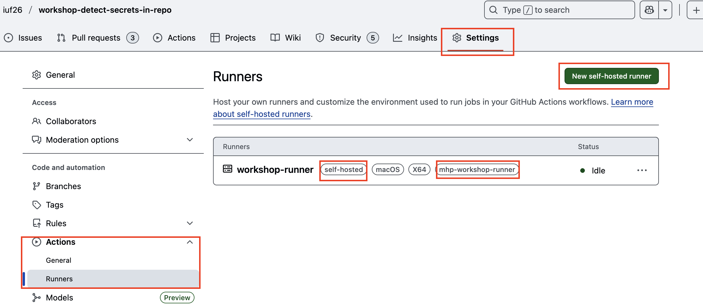
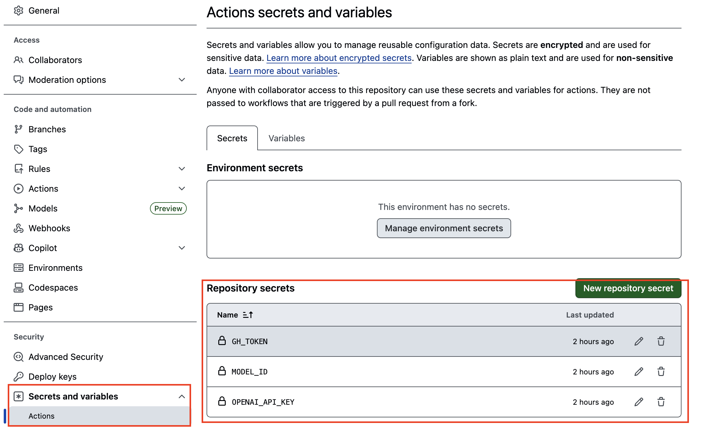
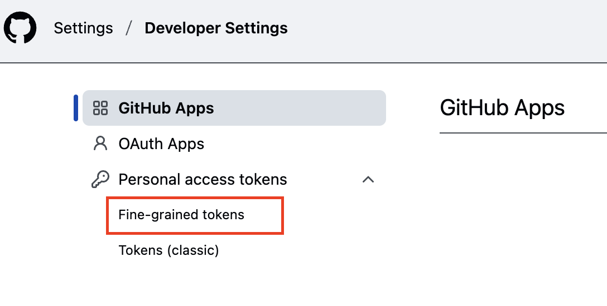

# Detect Secrets in Repo

This repository hosts an agentic workflow that scans pull requests for secrets and PII by combining the Microsoft Agent Framework with a GitHub MCP (Model Context Protocol) server. A GitHub Actions workflow runs the detectors automatically whenever a PR targets `main`, provided that a self-hosted runner is online.

Use this README as a quick-start guide for local development, workflow automation, and environment configuration.

## Requirements

- Python `3.11`
- Poetry `2.2.1`
- Docker Desktop or Docker Engine available on your path

Optional but helpful:

- [`github_mcp.ipynb`](github_mcp.ipynb) contains small experiments showing how to interact with the GitHub MCP server and build custom agents.

## Local Setup

```bash
# 1. Install dependencies
poetry install

# 2. Install the Microsoft Agent Framework preview
poetry run pip install --pre agent-framework
# or, if you want Poetry to manage it directly:
poetry run poetry add --allow-prereleases agent-framework

# 3. Start the local workflow/CLI
poetry run start
```

Running `poetry run start` launches the entry point defined in `pyproject.toml`, which in turn loads the domain agents found in `domain/agents`. Adjust `domain/settings.py` to point to your environment.

## GitHub Workflow

The automation lives in `.github/workflows/detect_secrets.yml`. It is triggered on pull requests against `main` and executes the same secret-scanning agents that you run locally. Because the workflow requires Docker and access to your development tools, it is configured for a **self-hosted runner**.

### Self-Hosted Runner Setup

1. Clone this repository onto the machine that will act as the runner.
2. In the GitHub UI, navigate to `Settings → Actions → Runners → New self-hosted runner`.
3. Select your OS, follow the registration instructions, and assign the labels `self-hosted` and `mhp-workshop-runner`.
4. Start the runner process and keep it running whenever you want PR scanning to occur.



Once the runner is online, every PR to `main` will trigger the workflow and automatically comment on the PR with any findings.

## Environment Variables

Copy `.env.example` to `.env` (or configure secrets in your CI system) and populate the following variables:

| Variable | Description |
| --- | --- |
| `BASE_URL` | OpenAI base URL, e.g. `https://api.openai.com/v1`. |
| `OPENAI_API_KEY` | API key authorized to call the chosen model. |
| `MODEL_ID` | Model identifier to use for agent reasoning. |
| `GITHUB_PAT_TOKEN` | Fine-grained GitHub PAT used by the workflow. |
| `GITHUB_REPO` | Repository name such as `owner/repo`. |
| `GITHUB_OWNER` | GitHub username or organization that owns the repo. |
| `TARGET_PR_NUMBER` | PR number the workflow should analyze. Usually passed in as an input during CI. |
| `SECRETS_DETECTOR_AGENT_COUNT` | Number of parallel agent workers (integer). |
| `DOCKER_EXEC_PATH` | Name or absolute path to your Docker executable (`docker` on macOS/Linux). |

### GitHub Actions Repository Secrets

Add these repository secrets in `Settings → Secrets and variables → Actions → Repository secrets` so the workflow can authenticate:

| Secret | Description |
| --- | --- |
| `GH_TOKEN` | GitHub PAT for the repository where you want to run secrets detection. |
| `MODEL_ID` | ID of the model the agents should use. |
| `OPENAI_API_KEY` | OpenAI API key that matches the selected model. |
| `GH_REPOSITORY` | Repository name (`owner/repo`) that should be analyzed. |
| `GH_REPOSITORY_OWNER` | Owner (user or org) of the repository to scan. |
| `GH_REPOSITORY_PR_NUMBER` | Pull request number targeted for analysis. |



### Creating the GitHub PAT

1. Go to `Profile → Settings → Developer Settings → Personal access tokens → Fine-grained tokens`.
2. Create a token scoped only to this repository.
3. Grant these permissions: Contents (read/write), Environments (read), Issues (read/write), Metadata (read), Pages (read), Pull requests (read/write).



Store the token as `GITHUB_PAT_TOKEN` in your `.env` file or the CI secret manager.


## Additional Resources

- Learn more about the GitHub MCP server: https://github.com/github/github-mcp-server
- `domain/agents/chunk_exporter.py` demonstrates how data is chunked for scanning.
- `samples/` includes example artifacts produced by the detectors.
